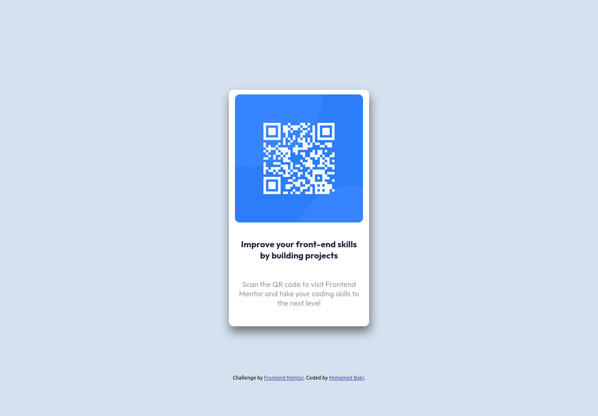

# Frontend Mentor - QR code component solution

This is a solution to the [QR code component challenge on Frontend Mentor](https://www.frontendmentor.io/challenges/qr-code-component-iux_sIO_H). Frontend Mentor challenges help you improve your coding skills by building realistic projects. 

## Table of contents

- [Overview](#overview)
  - [Screenshot](#screenshot)
  - [Links](#links)
- [My process](#my-process)
  - [Built with](#built-with)
  - [What I learned](#what-i-learned)
  - [Continued development](#continued-development)
  - [Useful resources](#useful-resources)
- [Author](#author)
- [Acknowledgments](#acknowledgments)

**Note: Delete this note and update the table of contents based on what sections you keep.**

## Overview

### Screenshot

### Links

- Solution URL: [Solution URL](https://github.com/MohammedBakr44/qr-code-frontendmentor)
- Live Site URL: [Live site URL](https://gilded-mooncake-0275d5.netlify.app/)

## My process
Building a container that holds all the items(instead of editing body directly). Using flexbox to center the card into the container, add the image and text.
### Built with

- Semantic HTML5 markup
- CSS custom properties
- Responsive design
- Flexbox

### What I learned

Flexbox and relative units, BEM.
To see how you can add code snippets, see below:

### Continued development
More implementation with CSS, and add more JS/React projects.

## Author
- Frontend Mentor - [@MohammedBakr44](https://www.frontendmentor.io/profile/MohammedBakr44)